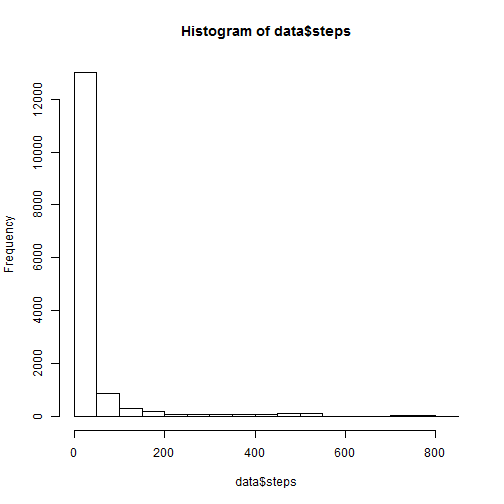
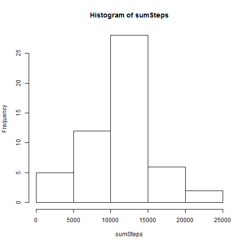
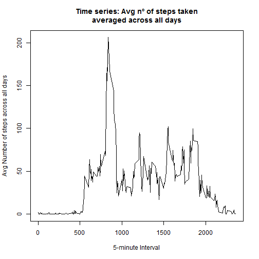
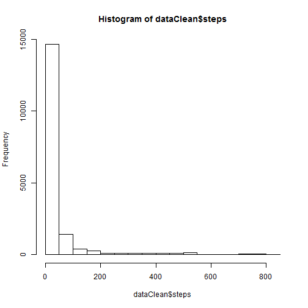
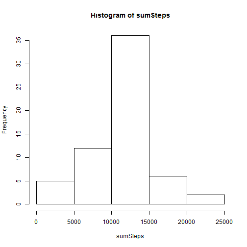
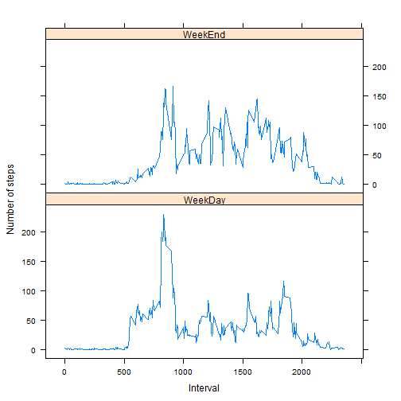

# Reproducible Research: Peer Assessment 1

## Loading and preprocessing the data

```r
library(lattice)
```

```
## Warning: package 'lattice' was built under R version 3.0.3
```

```r
library(data.table)
```

```
## Warning: package 'data.table' was built under R version 3.0.3
```

```r
library(plyr)
```

```
## Warning: package 'plyr' was built under R version 3.0.3
```

```r

data <- read.csv("activity.csv", header = TRUE, sep = ",", stringsAsFactors = FALSE)

data$formattedDate <- as.Date(data[, 2], format = "%Y-%m-%d")
data$weekDay <- weekdays(data[, 4])
```


## What is mean total number of steps taken per day?

```r
hist(data$steps)
```

 

```r

sumSteps <- tapply(data$steps, data$formattedDate, sum)

hist(sumSteps)
```

 

```r

auxData <- data
auxData <- auxData[!is.na(auxData$steps), ]
```


### Values of the "mean" total number of steps taken per day:

```r
meanSteps <- tapply(auxData$steps, auxData$formattedDate, mean)
meanSteps
```

```
## 2012-10-02 2012-10-03 2012-10-04 2012-10-05 2012-10-06 2012-10-07 
##     0.4375    39.4167    42.0694    46.1597    53.5417    38.2465 
## 2012-10-09 2012-10-10 2012-10-11 2012-10-12 2012-10-13 2012-10-14 
##    44.4826    34.3750    35.7778    60.3542    43.1458    52.4236 
## 2012-10-15 2012-10-16 2012-10-17 2012-10-18 2012-10-19 2012-10-20 
##    35.2049    52.3750    46.7083    34.9167    41.0729    36.0938 
## 2012-10-21 2012-10-22 2012-10-23 2012-10-24 2012-10-25 2012-10-26 
##    30.6285    46.7361    30.9653    29.0104     8.6528    23.5347 
## 2012-10-27 2012-10-28 2012-10-29 2012-10-30 2012-10-31 2012-11-02 
##    35.1354    39.7847    17.4236    34.0938    53.5208    36.8056 
## 2012-11-03 2012-11-05 2012-11-06 2012-11-07 2012-11-08 2012-11-11 
##    36.7049    36.2465    28.9375    44.7326    11.1771    43.7778 
## 2012-11-12 2012-11-13 2012-11-15 2012-11-16 2012-11-17 2012-11-18 
##    37.3785    25.4722     0.1424    18.8924    49.7882    52.4653 
## 2012-11-19 2012-11-20 2012-11-21 2012-11-22 2012-11-23 2012-11-24 
##    30.6979    15.5278    44.3993    70.9271    73.5903    50.2708 
## 2012-11-25 2012-11-26 2012-11-27 2012-11-28 2012-11-29 
##    41.0903    38.7569    47.3819    35.3576    24.4688
```

```r
# xtMean <- xtable(meanSteps) print(xtMean, type='html')
```


### Values of the "median" total number of steps taken per day:

```r
medianSteps <- tapply(auxData$steps, auxData$formattedDate, median)
medianSteps
```

```
## 2012-10-02 2012-10-03 2012-10-04 2012-10-05 2012-10-06 2012-10-07 
##          0          0          0          0          0          0 
## 2012-10-09 2012-10-10 2012-10-11 2012-10-12 2012-10-13 2012-10-14 
##          0          0          0          0          0          0 
## 2012-10-15 2012-10-16 2012-10-17 2012-10-18 2012-10-19 2012-10-20 
##          0          0          0          0          0          0 
## 2012-10-21 2012-10-22 2012-10-23 2012-10-24 2012-10-25 2012-10-26 
##          0          0          0          0          0          0 
## 2012-10-27 2012-10-28 2012-10-29 2012-10-30 2012-10-31 2012-11-02 
##          0          0          0          0          0          0 
## 2012-11-03 2012-11-05 2012-11-06 2012-11-07 2012-11-08 2012-11-11 
##          0          0          0          0          0          0 
## 2012-11-12 2012-11-13 2012-11-15 2012-11-16 2012-11-17 2012-11-18 
##          0          0          0          0          0          0 
## 2012-11-19 2012-11-20 2012-11-21 2012-11-22 2012-11-23 2012-11-24 
##          0          0          0          0          0          0 
## 2012-11-25 2012-11-26 2012-11-27 2012-11-28 2012-11-29 
##          0          0          0          0          0
```

```r
# xtMedian <- xtable(medianSteps) print(xtMedian, type='html')
```


## What is the average daily activity pattern?

```r

weekendIndex <- data$weekDay == "sábado" | data$weekDay == "domingo"
weekdayIndex <- data$weekDay != "sábado" & data$weekDay != "domingo"
data$weekDayOrWeekEnd[weekendIndex] <- "weekend"
data$weekDayOrWeekEndId[weekendIndex] <- 2
data$weekDayOrWeekEnd[weekdayIndex] <- "weekday"
data$weekDayOrWeekEndId[weekdayIndex] <- 1

data_DT <- data.table(auxData)
data_DT[, `:=`(date, NULL)]
```

```
##        steps interval formattedDate weekDay
##     1:     0        0    2012-10-02  martes
##     2:     0        5    2012-10-02  martes
##     3:     0       10    2012-10-02  martes
##     4:     0       15    2012-10-02  martes
##     5:     0       20    2012-10-02  martes
##    ---                                     
## 15260:     0     2335    2012-11-29  jueves
## 15261:     0     2340    2012-11-29  jueves
## 15262:     0     2345    2012-11-29  jueves
## 15263:     0     2350    2012-11-29  jueves
## 15264:     0     2355    2012-11-29  jueves
```

```r
data_DT[, `:=`(formattedDate, NULL)]
```

```
##        steps interval weekDay
##     1:     0        0  martes
##     2:     0        5  martes
##     3:     0       10  martes
##     4:     0       15  martes
##     5:     0       20  martes
##    ---                       
## 15260:     0     2335  jueves
## 15261:     0     2340  jueves
## 15262:     0     2345  jueves
## 15263:     0     2350  jueves
## 15264:     0     2355  jueves
```

```r
data_DT[, `:=`(weekDay, NULL)]
```

```
##        steps interval
##     1:     0        0
##     2:     0        5
##     3:     0       10
##     4:     0       15
##     5:     0       20
##    ---               
## 15260:     0     2335
## 15261:     0     2340
## 15262:     0     2345
## 15263:     0     2350
## 15264:     0     2355
```

```r
data_DT[, `:=`(weekDayOrWeekEnd, NULL)]
```

```
## Warning: Adding new column 'weekDayOrWeekEnd' then assigning NULL
## (deleting it).
```

```
##        steps interval
##     1:     0        0
##     2:     0        5
##     3:     0       10
##     4:     0       15
##     5:     0       20
##    ---               
## 15260:     0     2335
## 15261:     0     2340
## 15262:     0     2345
## 15263:     0     2350
## 15264:     0     2355
```

```r

intervalsMean <- data_DT[, lapply(.SD, mean), by = "interval"]

plot(x = intervalsMean$interval, y = intervalsMean$steps, type = "l", xlab = "5-minute Interval", 
    ylab = "Avg Number of steps across all days", main = "Time series: Avg nº of steps taken\naveraged across all days")
```

 


### Which 5-minute interval, on average across all the days in the dataset, contains the maximum number of steps?

```r
maxSteps <- max(intervalsMean$steps)
maxIndex <- which(intervalsMean$steps == maxSteps)
```


The 5-minute interval with the maximum number of steps:

```r
intervalsMean$interval[maxIndex]
```

```
## [1] 835
```


## Imputing missing values
### Calculate and report the total number of missing values in the dataset

```r
dataClean <- data
stepsNA <- is.na(dataClean$steps)
rowsNA <- stepsNA[stepsNA == TRUE]
```


The number of missing values in the dataset:

```r
length(rowsNA)
```

```
## [1] 2304
```


### Fill in the missing values and create a new dataset (using previously calculated 5-minute interval means):

```r
dataClean <- data
replaceData <- intervalsMean
replaceData$steps5minAvg <- replaceData$steps
replaceData[, `:=`(weekDayOrWeekEndId, NULL)]
```

```
## Warning: Adding new column 'weekDayOrWeekEndId' then assigning NULL
## (deleting it).
```

```
##      interval   steps steps5minAvg
##   1:        0 1.71698      1.71698
##   2:        5 0.33962      0.33962
##   3:       10 0.13208      0.13208
##   4:       15 0.15094      0.15094
##   5:       20 0.07547      0.07547
##  ---                              
## 284:     2335 4.69811      4.69811
## 285:     2340 3.30189      3.30189
## 286:     2345 0.64151      0.64151
## 287:     2350 0.22642      0.22642
## 288:     2355 1.07547      1.07547
```

```r
replaceData[, `:=`(steps, NULL)]
```

```
##      interval steps5minAvg
##   1:        0      1.71698
##   2:        5      0.33962
##   3:       10      0.13208
##   4:       15      0.15094
##   5:       20      0.07547
##  ---                      
## 284:     2335      4.69811
## 285:     2340      3.30189
## 286:     2345      0.64151
## 287:     2350      0.22642
## 288:     2355      1.07547
```

```r
dfList <- list(dataClean, replaceData)
dataClean <- join_all(dfList)
```

```
## Joining by: interval
```

```r
dataClean$steps[stepsNA] <- dataClean$steps5minAvg
```

```
## Warning: número de items para para sustituir no es un múltiplo de la
## longitud del reemplazo
```


### Make histograms (after imputing missing values):

```r
hist(dataClean$steps)
```

 

```r

sumSteps <- tapply(dataClean$steps, dataClean$formattedDate, sum)

hist(sumSteps)
```

 


### Values of the "mean" total number of steps taken per day (after imputing missing values):

```r
meanSteps <- tapply(dataClean$steps, dataClean$formattedDate, mean)
meanSteps
```

```
## 2012-10-01 2012-10-02 2012-10-03 2012-10-04 2012-10-05 2012-10-06 
##    37.3826     0.4375    39.4167    42.0694    46.1597    53.5417 
## 2012-10-07 2012-10-08 2012-10-09 2012-10-10 2012-10-11 2012-10-12 
##    38.2465    37.3826    44.4826    34.3750    35.7778    60.3542 
## 2012-10-13 2012-10-14 2012-10-15 2012-10-16 2012-10-17 2012-10-18 
##    43.1458    52.4236    35.2049    52.3750    46.7083    34.9167 
## 2012-10-19 2012-10-20 2012-10-21 2012-10-22 2012-10-23 2012-10-24 
##    41.0729    36.0938    30.6285    46.7361    30.9653    29.0104 
## 2012-10-25 2012-10-26 2012-10-27 2012-10-28 2012-10-29 2012-10-30 
##     8.6528    23.5347    35.1354    39.7847    17.4236    34.0938 
## 2012-10-31 2012-11-01 2012-11-02 2012-11-03 2012-11-04 2012-11-05 
##    53.5208    37.3826    36.8056    36.7049    37.3826    36.2465 
## 2012-11-06 2012-11-07 2012-11-08 2012-11-09 2012-11-10 2012-11-11 
##    28.9375    44.7326    11.1771    37.3826    37.3826    43.7778 
## 2012-11-12 2012-11-13 2012-11-14 2012-11-15 2012-11-16 2012-11-17 
##    37.3785    25.4722    37.3826     0.1424    18.8924    49.7882 
## 2012-11-18 2012-11-19 2012-11-20 2012-11-21 2012-11-22 2012-11-23 
##    52.4653    30.6979    15.5278    44.3993    70.9271    73.5903 
## 2012-11-24 2012-11-25 2012-11-26 2012-11-27 2012-11-28 2012-11-29 
##    50.2708    41.0903    38.7569    47.3819    35.3576    24.4688 
## 2012-11-30 
##    37.3826
```


### Values of the "median" total number of steps taken per day (after imputing missing values):

```r
medianSteps <- tapply(dataClean$steps, dataClean$formattedDate, median)
medianSteps
```

```
## 2012-10-01 2012-10-02 2012-10-03 2012-10-04 2012-10-05 2012-10-06 
##      34.11       0.00       0.00       0.00       0.00       0.00 
## 2012-10-07 2012-10-08 2012-10-09 2012-10-10 2012-10-11 2012-10-12 
##       0.00      34.11       0.00       0.00       0.00       0.00 
## 2012-10-13 2012-10-14 2012-10-15 2012-10-16 2012-10-17 2012-10-18 
##       0.00       0.00       0.00       0.00       0.00       0.00 
## 2012-10-19 2012-10-20 2012-10-21 2012-10-22 2012-10-23 2012-10-24 
##       0.00       0.00       0.00       0.00       0.00       0.00 
## 2012-10-25 2012-10-26 2012-10-27 2012-10-28 2012-10-29 2012-10-30 
##       0.00       0.00       0.00       0.00       0.00       0.00 
## 2012-10-31 2012-11-01 2012-11-02 2012-11-03 2012-11-04 2012-11-05 
##       0.00      34.11       0.00       0.00      34.11       0.00 
## 2012-11-06 2012-11-07 2012-11-08 2012-11-09 2012-11-10 2012-11-11 
##       0.00       0.00       0.00      34.11      34.11       0.00 
## 2012-11-12 2012-11-13 2012-11-14 2012-11-15 2012-11-16 2012-11-17 
##       0.00       0.00      34.11       0.00       0.00       0.00 
## 2012-11-18 2012-11-19 2012-11-20 2012-11-21 2012-11-22 2012-11-23 
##       0.00       0.00       0.00       0.00       0.00       0.00 
## 2012-11-24 2012-11-25 2012-11-26 2012-11-27 2012-11-28 2012-11-29 
##       0.00       0.00       0.00       0.00       0.00       0.00 
## 2012-11-30 
##      34.11
```


## Are there differences in activity patterns between weekdays and weekends?

```r
dataClean_DT <- data.table(dataClean)
dataClean_DT[, `:=`(date, NULL)]
```

```
##          steps interval formattedDate weekDay weekDayOrWeekEnd
##     1: 1.71698        0    2012-10-01   lunes          weekday
##     2: 0.33962        5    2012-10-01   lunes          weekday
##     3: 0.13208       10    2012-10-01   lunes          weekday
##     4: 0.15094       15    2012-10-01   lunes          weekday
##     5: 0.07547       20    2012-10-01   lunes          weekday
##    ---                                                        
## 17564: 4.69811     2335    2012-11-30 viernes          weekday
## 17565: 3.30189     2340    2012-11-30 viernes          weekday
## 17566: 0.64151     2345    2012-11-30 viernes          weekday
## 17567: 0.22642     2350    2012-11-30 viernes          weekday
## 17568: 1.07547     2355    2012-11-30 viernes          weekday
##        weekDayOrWeekEndId steps5minAvg
##     1:                  1      1.71698
##     2:                  1      0.33962
##     3:                  1      0.13208
##     4:                  1      0.15094
##     5:                  1      0.07547
##    ---                                
## 17564:                  1      4.69811
## 17565:                  1      3.30189
## 17566:                  1      0.64151
## 17567:                  1      0.22642
## 17568:                  1      1.07547
```

```r
dataClean_DT[, `:=`(formattedDate, NULL)]
```

```
##          steps interval weekDay weekDayOrWeekEnd weekDayOrWeekEndId
##     1: 1.71698        0   lunes          weekday                  1
##     2: 0.33962        5   lunes          weekday                  1
##     3: 0.13208       10   lunes          weekday                  1
##     4: 0.15094       15   lunes          weekday                  1
##     5: 0.07547       20   lunes          weekday                  1
##    ---                                                             
## 17564: 4.69811     2335 viernes          weekday                  1
## 17565: 3.30189     2340 viernes          weekday                  1
## 17566: 0.64151     2345 viernes          weekday                  1
## 17567: 0.22642     2350 viernes          weekday                  1
## 17568: 1.07547     2355 viernes          weekday                  1
##        steps5minAvg
##     1:      1.71698
##     2:      0.33962
##     3:      0.13208
##     4:      0.15094
##     5:      0.07547
##    ---             
## 17564:      4.69811
## 17565:      3.30189
## 17566:      0.64151
## 17567:      0.22642
## 17568:      1.07547
```

```r
dataClean_DT[, `:=`(weekDay, NULL)]
```

```
##          steps interval weekDayOrWeekEnd weekDayOrWeekEndId steps5minAvg
##     1: 1.71698        0          weekday                  1      1.71698
##     2: 0.33962        5          weekday                  1      0.33962
##     3: 0.13208       10          weekday                  1      0.13208
##     4: 0.15094       15          weekday                  1      0.15094
##     5: 0.07547       20          weekday                  1      0.07547
##    ---                                                                  
## 17564: 4.69811     2335          weekday                  1      4.69811
## 17565: 3.30189     2340          weekday                  1      3.30189
## 17566: 0.64151     2345          weekday                  1      0.64151
## 17567: 0.22642     2350          weekday                  1      0.22642
## 17568: 1.07547     2355          weekday                  1      1.07547
```

```r
dataClean_DT[, `:=`(weekDayOrWeekEnd, NULL)]
```

```
##          steps interval weekDayOrWeekEndId steps5minAvg
##     1: 1.71698        0                  1      1.71698
##     2: 0.33962        5                  1      0.33962
##     3: 0.13208       10                  1      0.13208
##     4: 0.15094       15                  1      0.15094
##     5: 0.07547       20                  1      0.07547
##    ---                                                 
## 17564: 4.69811     2335                  1      4.69811
## 17565: 3.30189     2340                  1      3.30189
## 17566: 0.64151     2345                  1      0.64151
## 17567: 0.22642     2350                  1      0.22642
## 17568: 1.07547     2355                  1      1.07547
```

```r

intervalsMean <- dataClean_DT[, lapply(.SD, mean), by = "interval,weekDayOrWeekEndId"]

weekDayIndex <- intervalsMean$weekDayOrWeekEndId == 1
weekEndIndex <- intervalsMean$weekDayOrWeekEndId == 2
intervalsMean$weekDay[weekDayIndex] <- "WeekDay"
intervalsMean$weekDay[weekEndIndex] <- "WeekEnd"

xyplot(intervalsMean$steps ~ intervalsMean$interval | intervalsMean$weekDay, 
    layout = c(1, 2), type = "l", xlab = "Interval", ylab = "Number of steps")
```

 

